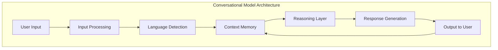
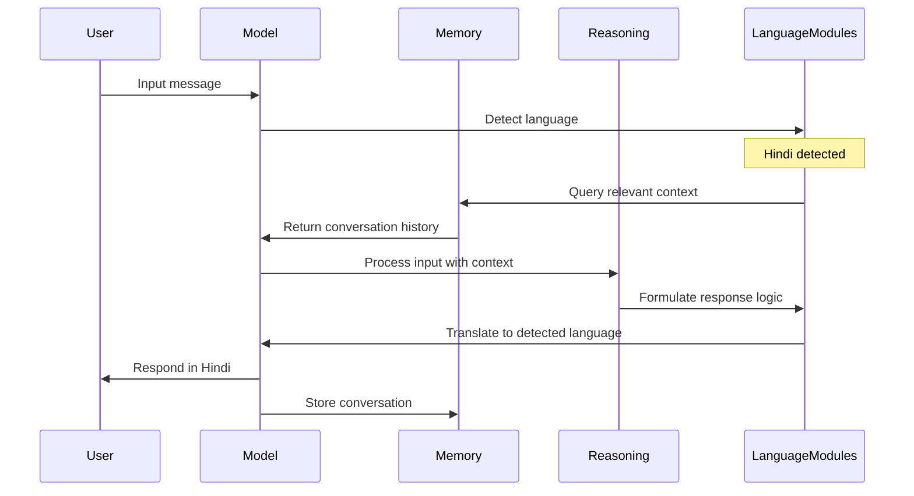
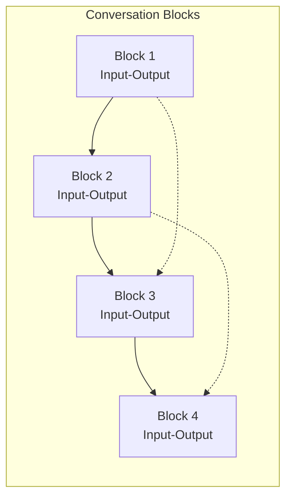
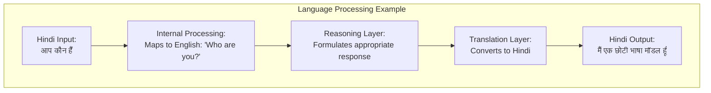
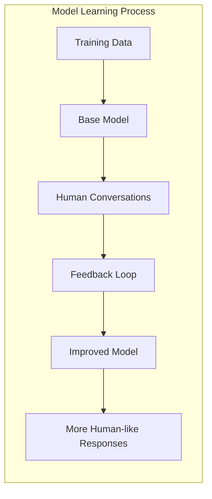

Here's a visualization of the conversational model from scratch using Mermaid diagrams:

These diagrams illustrate:
1. The overall architecture of the conversational model
2. The sequence of handling a multilingual conversation
3. How conversation blocks connect with references to previous blocks
4. The language processing flow for a Hindi example
5. How the model learns to become more human-like through training
