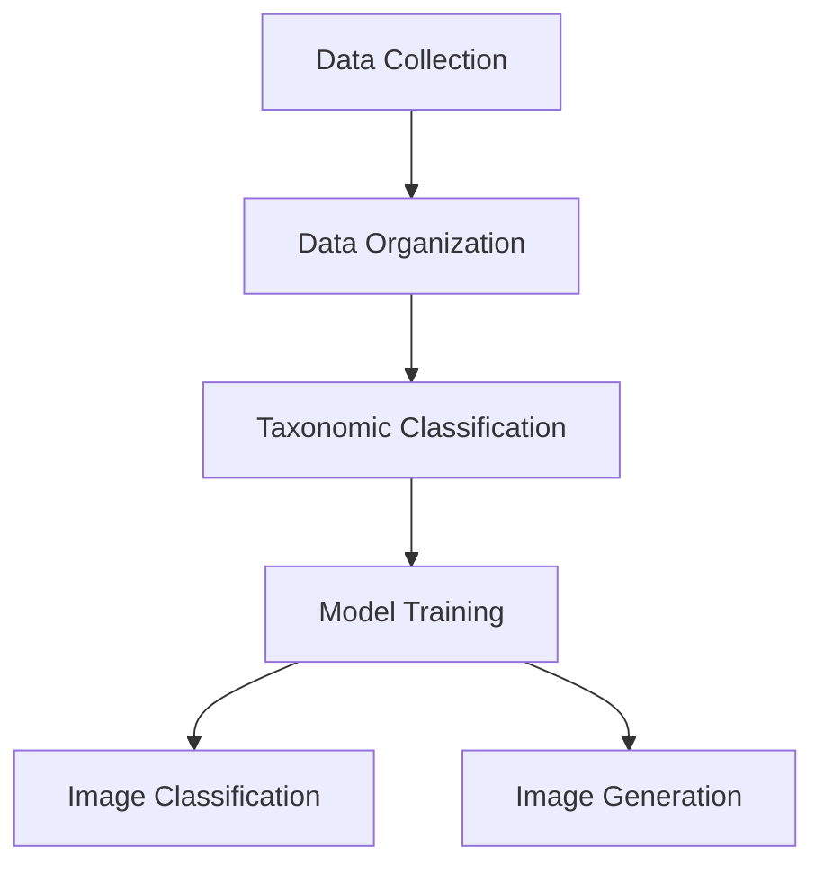
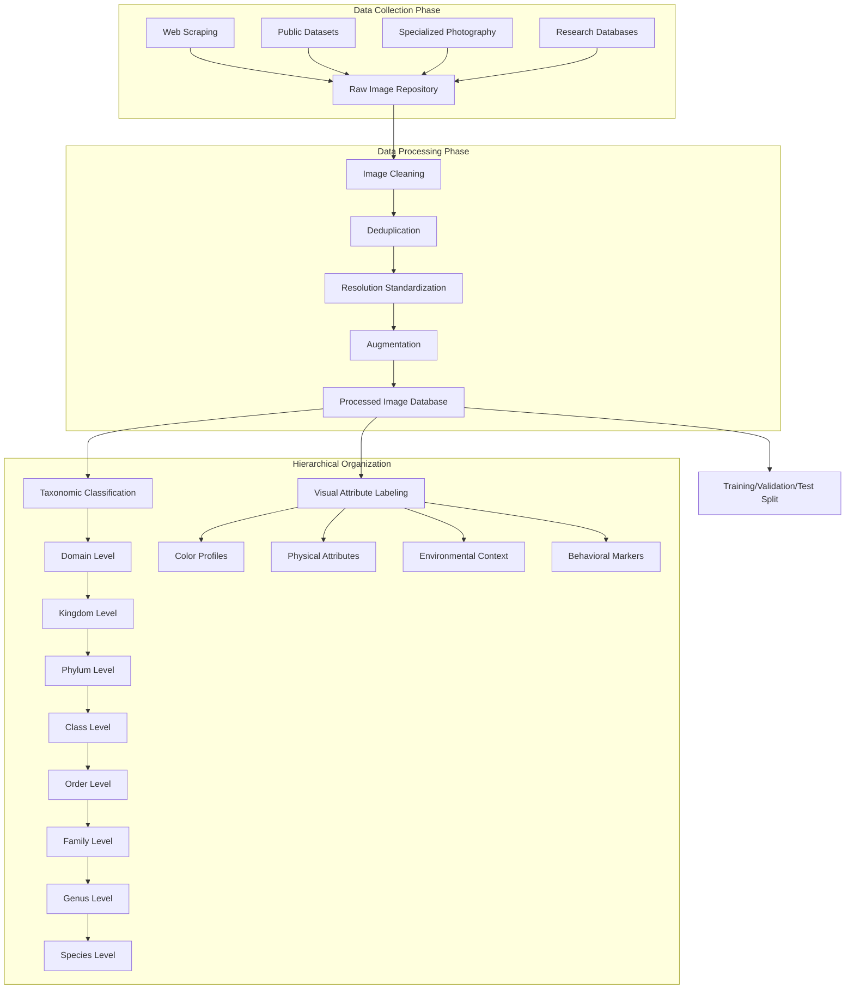
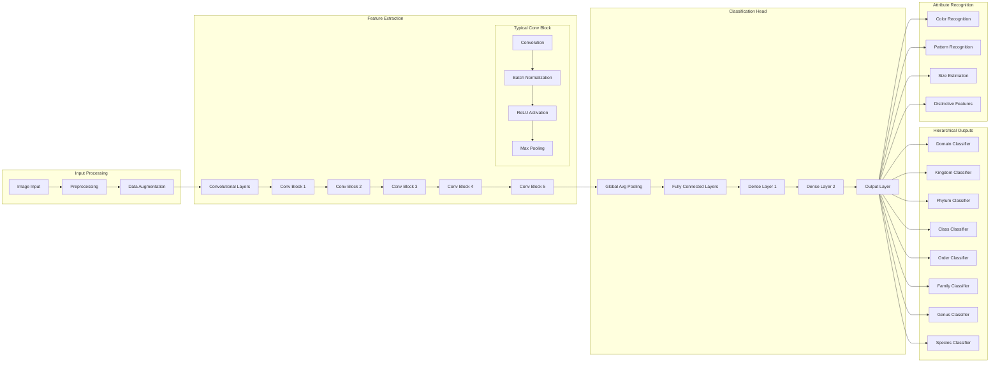
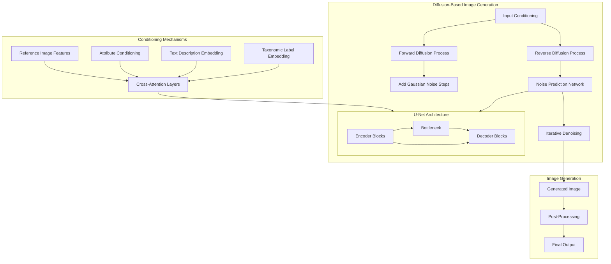
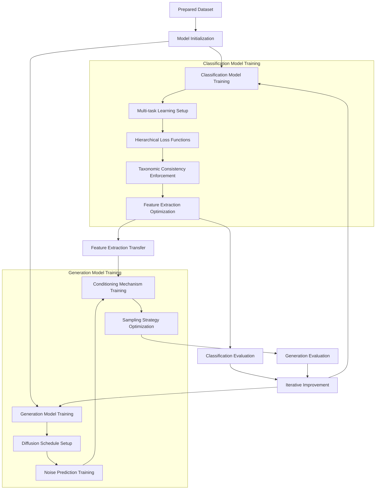
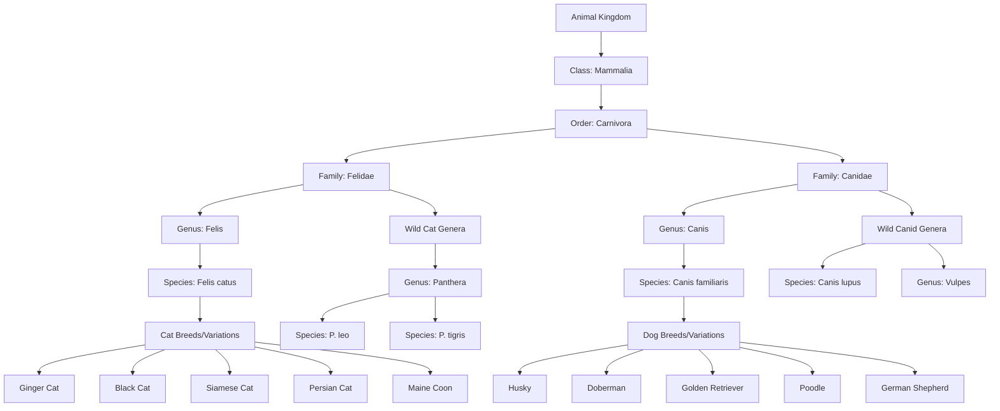
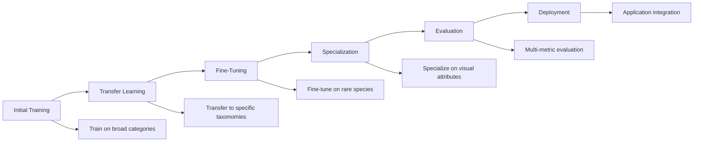
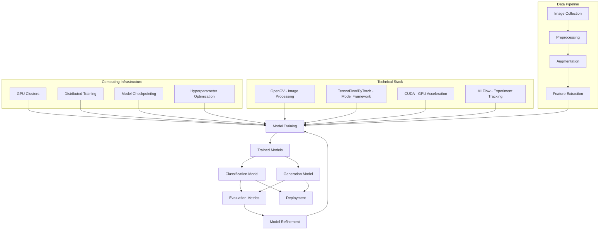

# Building an Image Model from Scratch

## Overview Architecture



## 1. Data Collection & Preparation Pipeline



## 2. Image Classification Model Architecture



## 3. Image Generation Architecture (GAN/Diffusion)



## 4. Training Pipeline



## 5. Hierarchical Classification Example: Cats and Dogs



## 6. Implementation Details

### Data Collection and Organization

1. **Massive Image Dataset Acquisition**:
   - Collect millions of diverse animal images
   - Source from ImageNet, iNaturalist, research repositories
   - Web scraping with proper attribution and licensing
   - Partner with zoological institutions and wildlife photographers

2. **Hierarchical Labeling System**:
   ```
   Domain → Kingdom → Phylum → Class → Order → Family → Genus → Species → Breed/Variant
   ```

3. **Visual Attribute Annotation**:
   - Color patterns (ginger, black, spotted, striped)
   - Size metrics (relative to standard references)
   - Distinctive features (ear shape, tail length, facial structure)
   - Habitat context (domestic, wild, geographical region)

4. **Evolutionary Relationship Mapping**:
   - Create relationship graphs between species
   - Document common ancestors and divergence points
   - Map visual similarities between related species

### Model Architecture Components

1. **Base Classification Network**:
   - CNN backbone (ResNet, EfficientNet)
   - Vision Transformer components for attention mechanisms
   - Feature pyramid networks for multi-scale feature extraction

2. **Hierarchical Classification Heads**:
   - Separate classifiers for each taxonomic level
   - Shared feature backbone
   - Consistency enforcement between levels

3. **Image Generation System**:
   - Diffusion model with conditioning
   - Class-conditional generation capabilities
   - Text-to-image conditioning for fine-grained control

### Model Training Process



1. **Progressive Training Strategy**:
   - Start with coarse classification (mammal vs. bird)
   - Progress to finer-grained categories (family, genus)
   - Finally train on species and variant recognition

2. **Multi-Task Learning**:
   - Joint optimization of taxonomic classification
   - Attribute recognition
   - Relationship understanding
   - Feature embedding quality

3. **Contrastive Learning Techniques**:
   - Learn similarities between visually related species
   - Understand differences between similar-looking but taxonomically distant species

4. **Knowledge Distillation**:
   - Train large teacher models
   - Distill knowledge into more efficient student models
   - Maintain accuracy while reducing model size

### Practical Applications

1. **Image Classification Applications**:
   - Wildlife identification in conservation efforts
   - Pet breed identification
   - Educational tools for biology students
   - Research tools for zoologists

2. **Image Generation Applications**:
   - Visualization of extinct or endangered species
   - Educational content creation
   - Cross-breed visualization
   - Aging/development visualization of animals

3. **Mixed Applications**:
   - Identifying animals in complex scenes
   - Separating similar-looking species
   - Understanding evolutionary relationships through visual traits
   - Generating variations of animals based on genetic information

## 7. Technical Implementation



This comprehensive approach builds an image model from scratch that can both recognize and generate animals with taxonomic precision, understanding the evolutionary relationships and visual characteristics that define different species. The hierarchical structure ensures the model doesn't just memorize patterns but understands the biological taxonomy, making it capable of generalizing to new examples and related species.
