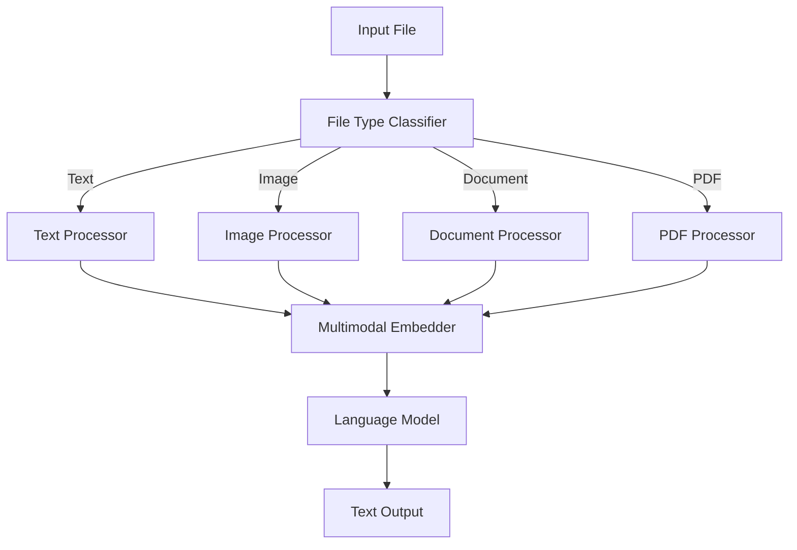
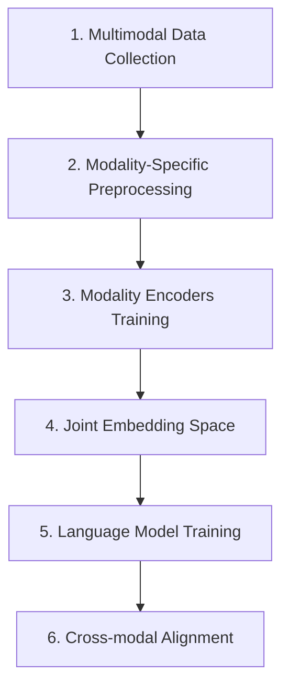
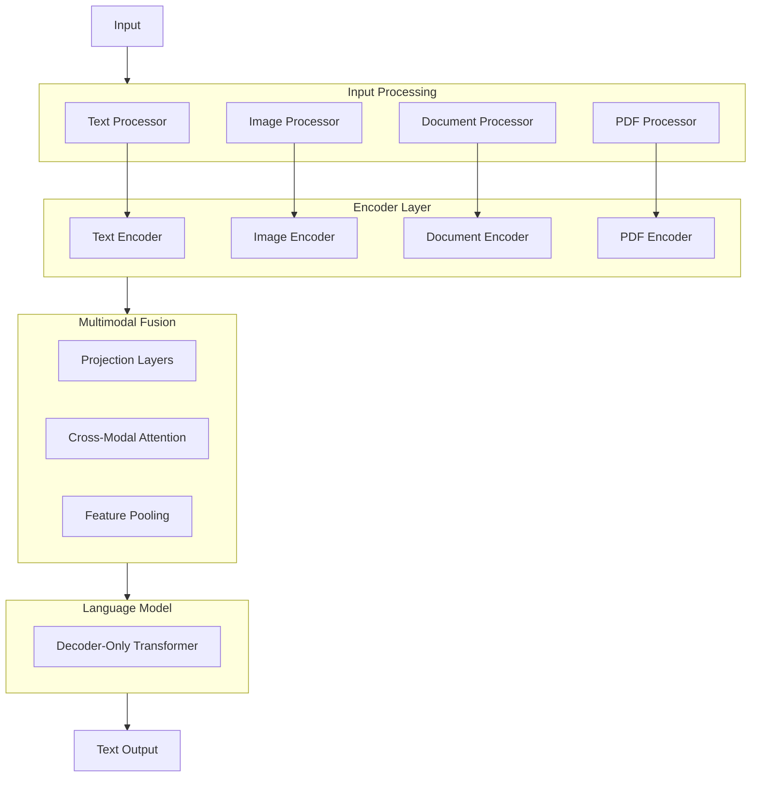

# Building a Multimodal Model From Scratch

A multimodal model that accepts various input types (text, image, documents, PDFs) but produces text-only output requires specific processing pipelines for each input modality before feeding the processed data into a language model. Here's a refined approach:

## Input Processing Pipeline

### 1. Input Type Classification & Routing

### 2. Processing Modules for Each Input Type

#### Text Processing
- Direct tokenization
- Language detection
- Basic NLP preprocessing (lowercasing, stopword removal, stemming/lemmatization as needed)
- Embedding generation

#### Image Processing
- Image feature extraction using computer vision models (ResNet, CLIP, etc.)
- Object detection and recognition
- OCR (Optical Character Recognition) for text in images using:
  * Tesseract for general text
  * Specialized OCR for handwriting if needed
- Scene text understanding
- Image captioning to convert visual content to textual descriptions
- Convert visual features to embedding space compatible with text

#### Document Processing (DOCX, Excel, etc.)
- Format-specific parsers:
  * python-docx for Word documents
  * pandas/openpyxl for Excel files
  * json/xml parsers for structured data
- Structure preservation (headings, tables, formatting)
- Metadata extraction
- Convert to unified text representation while preserving document structure
- Generate embeddings for document components

#### PDF Processing
- PDF parsing with hybrid approach:
  * PDF text extraction for machine-readable text
  * OCR for scanned content
  * Image extraction and processing for embedded images
  * Table detection and extraction
- Document layout analysis to understand structure
- Font and style analysis
- Creation of semantic document representation

## Training the Multimodal System

### 1. Two-Stage Training Approach

### 2. Implementation Details

#### Multimodal Data Collection
- Paired datasets with multiple modalities (e.g., MS COCO, Wikipedia articles with images)
- Document-level multimodal datasets (reports, articles, presentations)
- Cross-modal grounding datasets

#### Modality-Specific Preprocessing
- Apply the processing pipelines described above
- Normalize features across modalities
- Handle missing modalities

#### Modality Encoders Training
- Train specialized encoders for each input type:
  * Text encoder (Transformer-based)
  * Image encoder (CNN or Vision Transformer)
  * Document structure encoder
- Each encoder maps its modality to a shared latent space

#### Joint Embedding Space
- Train projection layers that map each modality's representations to a common semantic space
- Use contrastive learning objectives (e.g., CLIP-style) to align representations
- Ensure that semantically similar content across modalities maps to similar regions in embedding space

#### Language Model Integration
- Feed the unified embeddings into a language model
- Train the language model to generate text conditioned on multimodal inputs
- Use techniques like cross-attention to allow text generation to attend to different input modalities

#### Cross-modal Alignment
- Fine-tune with tasks requiring integration of information across modalities:
  * Image captioning
  * Visual question answering
  * Document question answering
  * Cross-modal reasoning tasks

## Technical Architecture

## Training Strategies

1. **Sequential Training**:
   - Train modality-specific encoders separately
   - Freeze encoders and train fusion components
   - Fine-tune end-to-end with lower learning rates

2. **End-to-End Training**:
   - Initialize with pretrained encoders
   - Train the entire pipeline jointly
   - Requires more computation but may yield better performance

3. **Knowledge Distillation**:
   - Use pretrained specialist models to teach the multimodal model
   - Distill knowledge from larger models into the multimodal system

## Evaluation Metrics

- Cross-modal retrieval performance
- Text generation quality (BLEU, ROUGE, BERTScore)
- Task-specific metrics for downstream applications
- Human evaluation of output coherence and accuracy

This architecture allows for processing diverse input types while maintaining a text-only output interface, leveraging the strengths of specialized processors for each modality while unifying them in a common semantic space for language generation.
