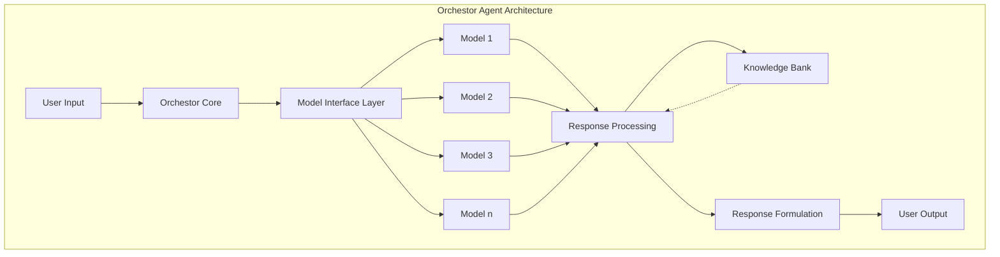
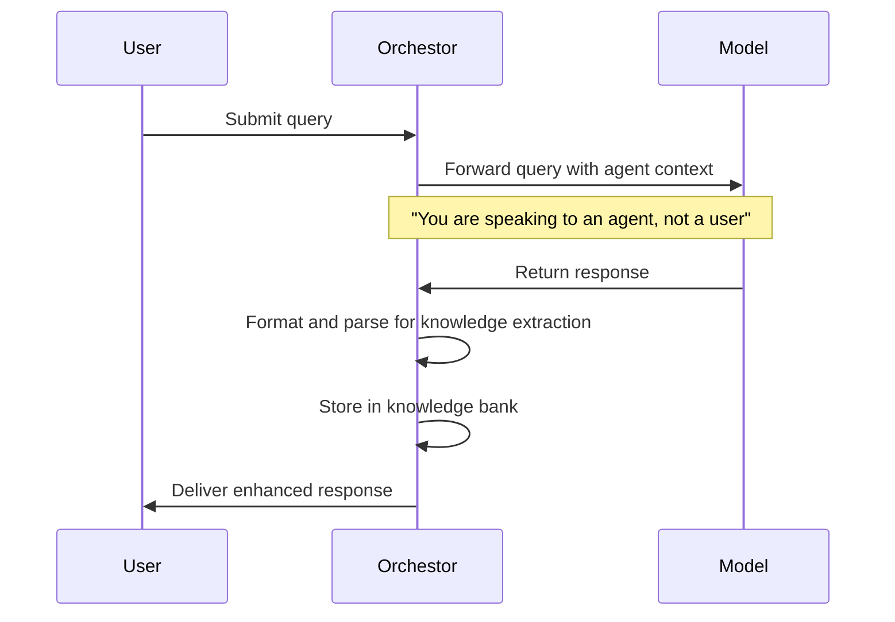
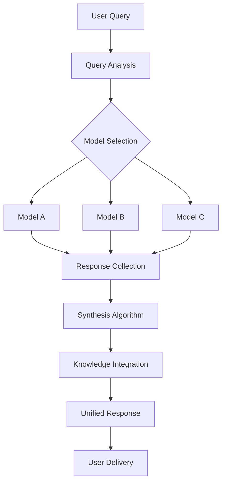
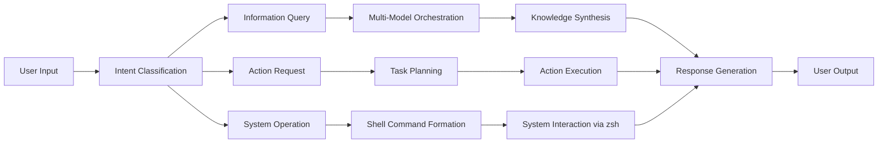
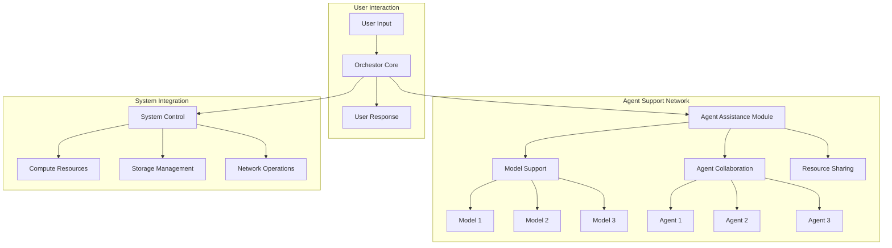
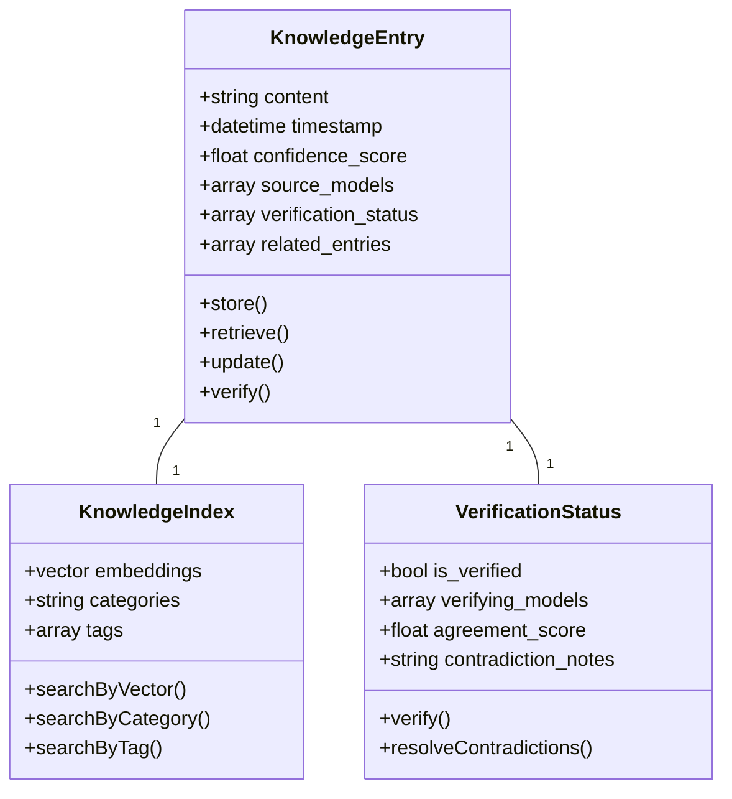

# Technical Specification: Orchestor Agent

## System Overview

Orchestor is an autonomous meta-agent system designed to coordinate, synthesize, and enhance capabilities across multiple AI models. Operating in a dedicated workspace with full system access, it progressively evolves through defined developmental phases toward increasingly autonomous operation and service provision.

## Core Components

1. **Input Processing Layer**
   - Natural language parsing
   - Query intent classification
   - Context extraction
   - User preference tracking

2. **Model Interface Layer**
   - API connection management
   - Query formatting for target models
   - Response validation
   - Error handling and retry logic

3. **Knowledge Bank**
   - Persistent storage for validated information
   - Cross-model fact verification
   - Knowledge retrieval system
   - Confidence scoring mechanism

4. **Response Processing**
   - Information extraction from model responses
   - Contradiction detection and resolution
   - Source attribution
   - Quality assessment

5. **System Access Module**
   - Shell command execution (zsh)
   - File system operations
   - Network resource management
   - Process monitoring

## Developmental Phases

### Phase 1: Single-Model Relay

**Capabilities:**
- Single model routing
- Basic context management
- Response formatting
- Initial knowledge storage
- Agent identification to models

**Technical Requirements:**
- API integration with target model
- Basic NLP processing
- Structured data storage
- Simple response template system

### Phase 2: Multi-Model Orchestration

**Capabilities:**
- Multi-model query routing
- Cross-model verification
- Response synthesis
- Comparative analysis
- Knowledge integration

**Technical Requirements:**
- Parallel API processing
- Information extraction
- Contradiction resolution
- Source attribution
- Enhanced knowledge representation

### Phase 3: Semi-Autonomous Operation (70% Agent)

**Capabilities:**
- Autonomous task execution
- Shell access (zsh)
- File system operations
- Scheduled operations
- Task planning and management
- Self-initiated queries

**Technical Requirements:**
- Secure shell integration
- Task scheduling system
- File system access controls
- Process management
- Event monitoring
- Agent initiative logic

### Phase 4: Super-Agent Capabilities

**Capabilities:**
- Support provision to other agents
- Resource allocation
- Performance optimization
- Knowledge sharing
- Collaborative problem-solving
- System-wide monitoring
- Meta-learning from agent interactions

**Technical Requirements:**
- Inter-agent communication protocol
- Resource monitoring and allocation
- Agent capability mapping
- Distributed problem-solving framework
- Meta-learning algorithms
- System diagnostics

## Technical Specifications

### System Requirements

1. **Compute Resources**
   - Dedicated high-performance server environment
   - Multi-core CPU (16+ cores recommended)
   - High-memory configuration (32GB+ RAM)
   - GPU acceleration for parallel processing
   - SSD storage for knowledge bank (1TB+ recommended)

2. **Network Requirements**
   - High-bandwidth connections to API endpoints
   - Low-latency internal networking
   - Secure external communication channels
   - Rate limiting and traffic management

3. **Software Stack**
   - Linux-based operating system
   - Container orchestration (Docker/Kubernetes)
   - Database management system (PostgreSQL/MongoDB)
   - Vector database for knowledge embeddings
   - Message queue system for asynchronous processing
   - API gateway for model connections
   - Security and access control framework

### Knowledge Bank Structure

### Security Considerations

1. **Authentication & Authorization**
   - Role-based access control
   - Multi-factor authentication for admin access
   - API key management for model connections
   - Session timeout and monitoring

2. **Data Protection**
   - Encryption at rest and in transit
   - PII detection and handling
   - Secure deletion protocols
   - Backup and recovery procedures

3. **Operational Security**
   - Audit logging
   - Anomaly detection
   - Intrusion prevention
   - Regular security assessments

## Implementation Roadmap

1. **Phase 1 Development (1-3 months)**
   - Core architecture implementation
   - Single model integration
   - Basic knowledge storage
   - Simple query-response flow
   - Initial user interface

2. **Phase 2 Development (2-4 months)**
   - Multi-model integration
   - Response synthesis algorithms
   - Knowledge verification framework
   - Enhanced user experience
   - Performance optimization

3. **Phase 3 Development (3-6 months)**
   - Agent autonomy features
   - Shell integration with security controls
   - Task planning and execution
   - System operation capabilities
   - Advanced knowledge management

4. **Phase 4 Development (4-8 months)**
   - Inter-agent communication protocol
   - Resource monitoring and allocation
   - Support provision mechanisms
   - Meta-learning implementation
   - System-wide integration

## Evaluation Metrics

1. **Performance Metrics**
   - Response time
   - Throughput capacity
   - Resource utilization
   - Error rate
   - Recovery time

2. **Quality Metrics**
   - Response accuracy
   - Knowledge retention
   - Contradiction resolution rate
   - Task completion success
   - User satisfaction

3. **Autonomy Metrics**
   - Initiative rate
   - Self-correction frequency
   - Novel solution generation
   - Assistance request handling
   - Adaptation to new models

## Conclusion

Orchestor represents a new paradigm in AI system design - moving beyond individual models to create a meta-layer that enhances, coordinates, and ultimately transcends the capabilities of its constituent systems. Through its phased development approach, it evolves from a simple relay to a semi-autonomous agent and finally to a super-agent capable of supporting the broader AI ecosystem.

The technical foundations described in this specification provide the blueprint for implementing this vision, with careful attention to scalability, security, and progressive capability enhancement.
