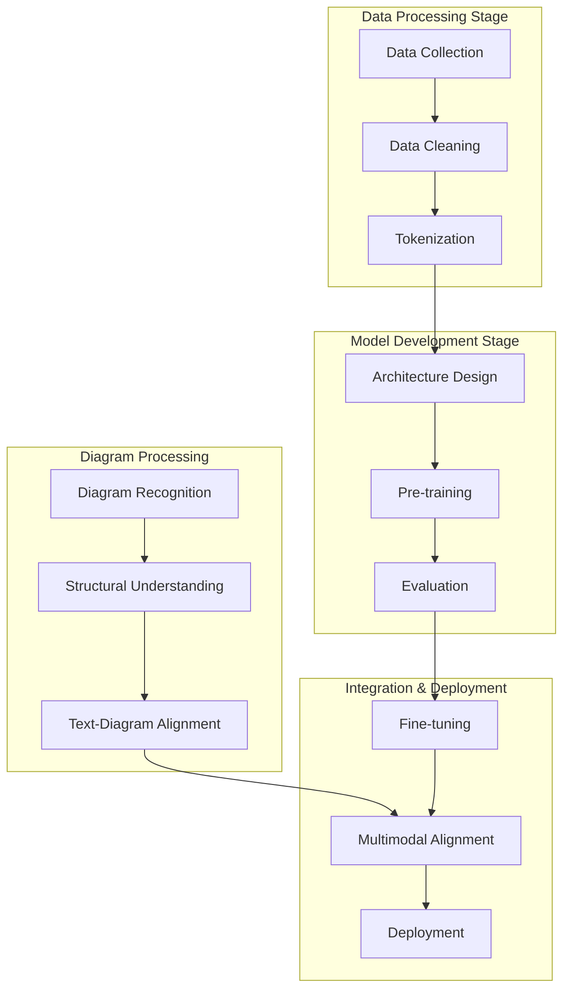
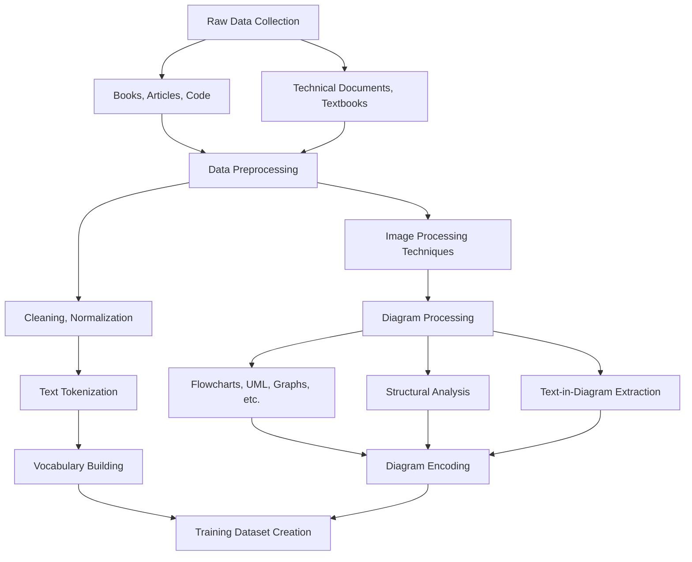
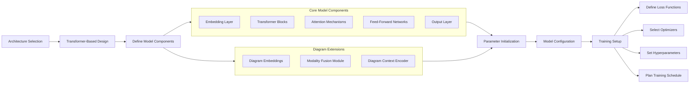
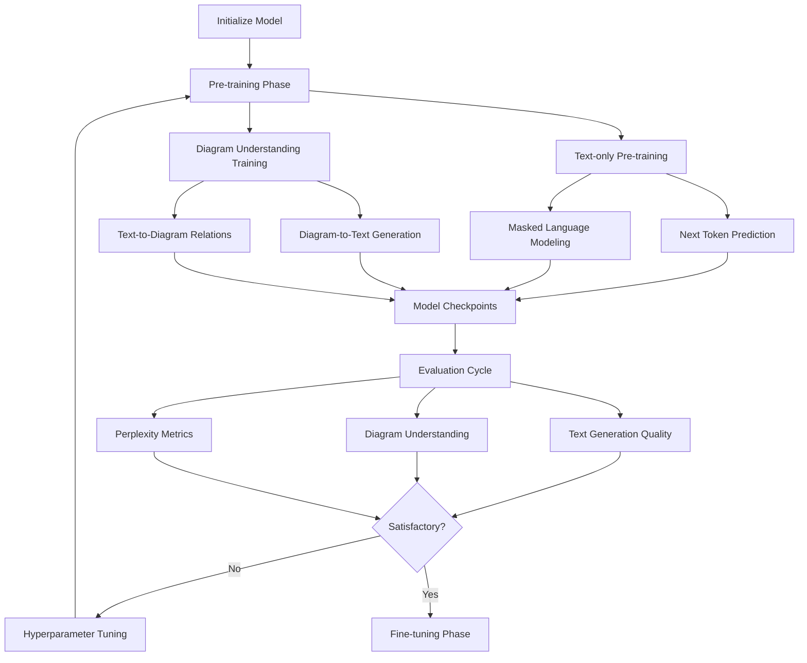
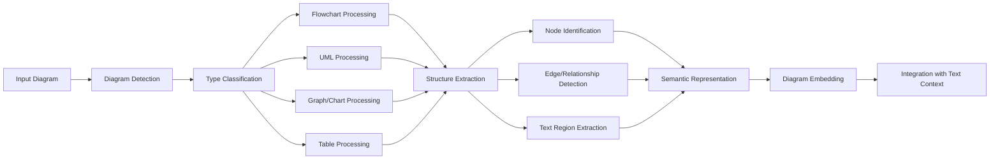
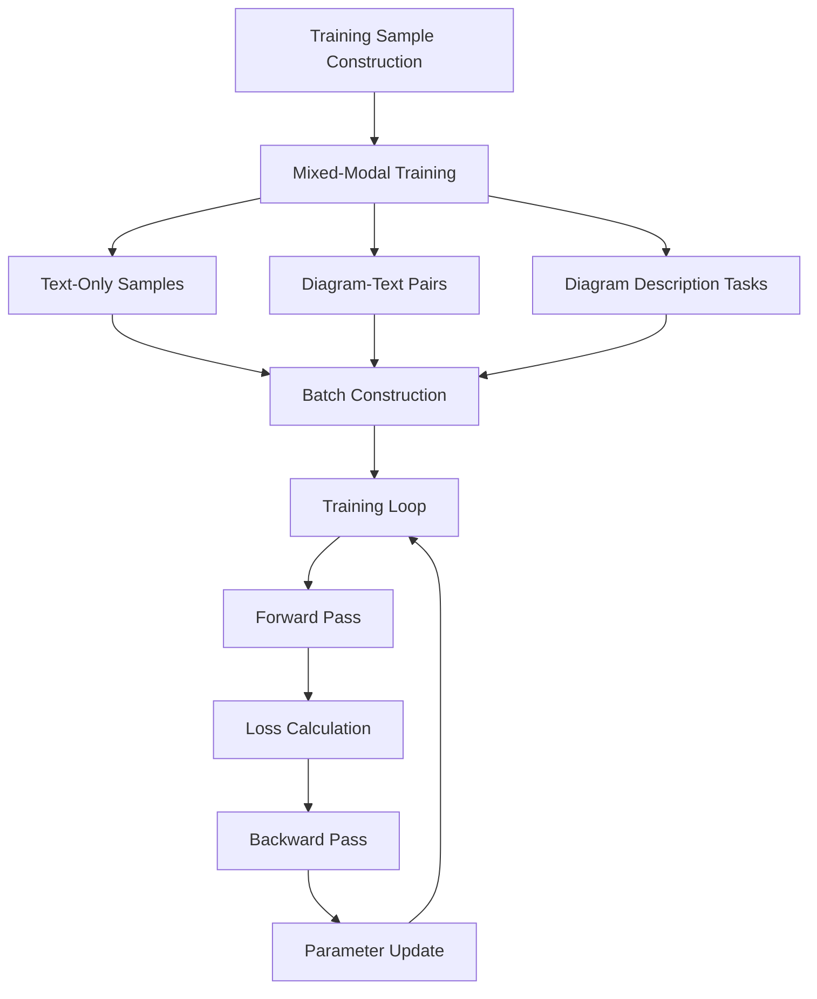
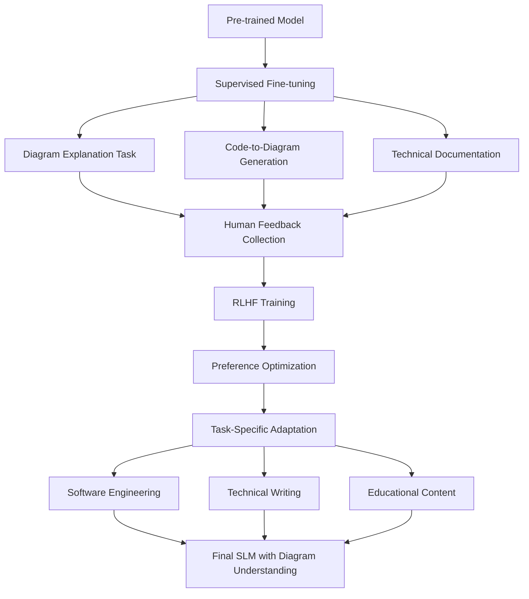
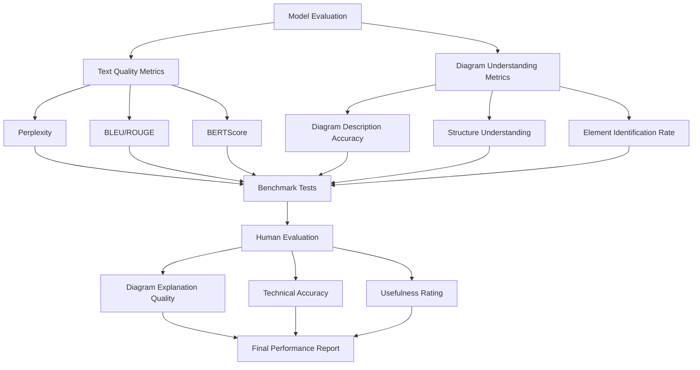
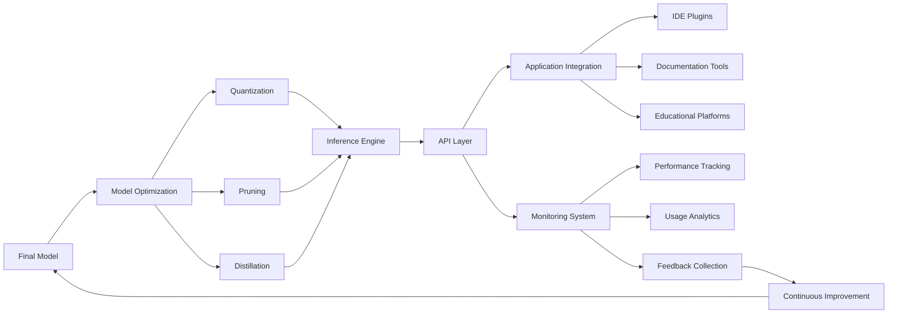

# Building a Small Language Model (SLM) from Scratch with Diagram Support

## Overview Architecture

## Detailed Process for SLM with Diagram Support

### 1. Data Collection & Processing

### 2. Model Architecture Design

### 3. Training Process

### 4. Diagram Processing Pipeline

### 5. Training Data Format

### 6. Fine-tuning & Alignment

### 7. Model Evaluation Framework

### 8. Deployment Architecture

## Technical Implementation Details

### Diagram Processing Techniques

1. **Diagram Detection and Classification**:
   - Computer vision techniques to identify diagrams in documents
   - CNN-based classifiers to categorize diagram types (flowcharts, UML, ER diagrams, etc.)
   - Region proposal networks for diagram boundary detection

2. **Structure Extraction**:
   - Edge detection and contour analysis for identifying shapes
   - Line detection algorithms (Hough transform) for connections
   - Graph construction from visual elements
   - Arrow direction identification for flow understanding

3. **Text-in-Diagram Processing**:
   - OCR for text extraction from diagram elements
   - Text-to-element association
   - Role classification of text (labels, annotations, headers)

### SLM Architecture with Diagram Support

1. **Core Language Model**:
   - Decoder-only transformer architecture (like smaller GPT variants)
   - Vocabulary incorporating special tokens for diagram elements
   - 125M to 1B parameters (depending on resource constraints)

2. **Diagram Understanding Components**:
   - Diagram element embeddings
   - Graph attention networks for structural understanding
   - Cross-modal attention between text and diagram elements

3. **Training Objectives**:
   - Next token prediction for text generation
   - Diagram element prediction for structure understanding
   - Text-diagram alignment through contrastive learning

### Training Efficiency for SLM

1. **Resource-Efficient Training**:
   - Mixed precision training (FP16)
   - Gradient accumulation for larger effective batch sizes
   - Model parallelism for distributed training
   - Checkpoint optimization

2. **Transfer Learning**:
   - Initialize from existing SLMs for text capabilities
   - Add and train diagram-specific components
   - Progressive layer unfreezing during fine-tuning

This approach creates a small language model with specialized capabilities for understanding and reasoning about diagrams, while maintaining a manageable parameter count and training resource requirement.
