# Technical Documentation: Building a Conversational Model from Scratch

## 1. Introduction

This technical document outlines the architecture, design principles, and implementation methodology for constructing a conversational model from scratch. The model is designed to handle multi-turn dialogues across multiple languages, maintain contextual memory, and produce coherent, relevant responses.

## 2. System Overview

A conversational model is an AI system designed to engage in dialogue with users, maintaining context across multiple turns while providing relevant and coherent responses. Unlike simple question-answering systems, conversational models must track conversation history, understand context, and generate contextually appropriate responses.

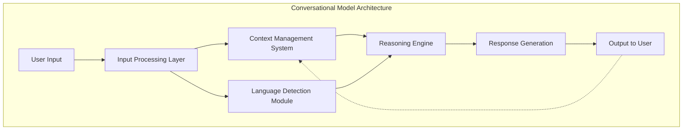

## 3. Key Components

### 3.1 Input Processing Layer

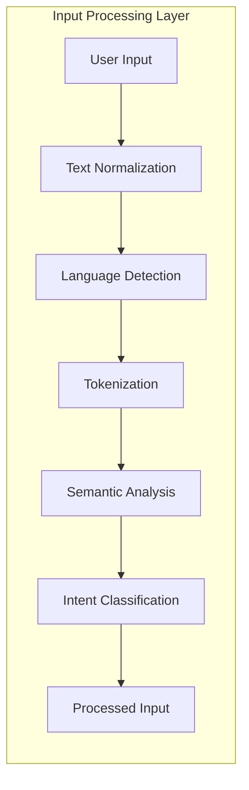

The Input Processing Layer handles the transformation of raw user input into a structured representation that can be processed by the model:

- **Text Normalization**: Standardizes input text by handling casing, punctuation, and special characters
- **Language Detection**: Identifies the language of the input to enable multilingual processing
- **Tokenization**: Breaks text into tokens (words, subwords, or characters)
- **Semantic Analysis**: Extracts meaning, entities, and relationships from the input
- **Intent Classification**: Identifies the user's purpose or goal in the current utterance

### 3.2 Context Management System

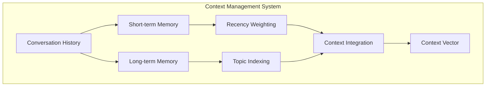

The Context Management System maintains conversational state across multiple turns:

- **Short-term Memory**: Stores recent conversation turns (typically the last 5-10 exchanges)
- **Long-term Memory**: Retains key information from earlier in the conversation
- **Recency Weighting**: Applies higher importance to more recent exchanges
- **Topic Indexing**: Organizes information by topic for efficient retrieval
- **Context Integration**: Combines relevant context into a unified representation

### 3.3 Language Detection Module

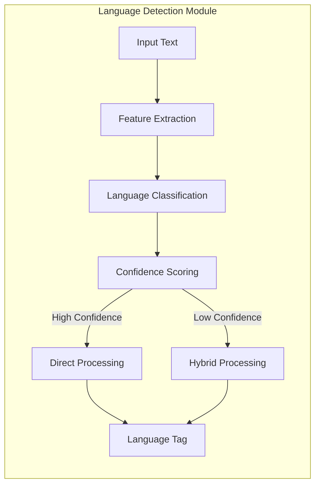

The Language Detection Module enables multilingual capabilities:

- **Feature Extraction**: Identifies language-specific patterns and n-grams
- **Language Classification**: Categorizes input into specific languages
- **Confidence Scoring**: Assesses reliability of language detection
- **Hybrid Processing**: Handles code-switching or multilingual input

### 3.4 Reasoning Engine

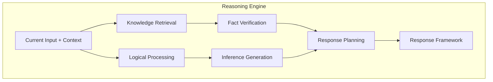

The Reasoning Engine processes input within context to determine appropriate responses:

- **Knowledge Retrieval**: Accesses relevant information from the model's parameters
- **Logical Processing**: Applies reasoning steps to understand implications
- **Fact Verification**: Checks factual consistency where possible
- **Inference Generation**: Draws conclusions based on input and context
- **Response Planning**: Structures the framework for response generation

### 3.5 Response Generation System

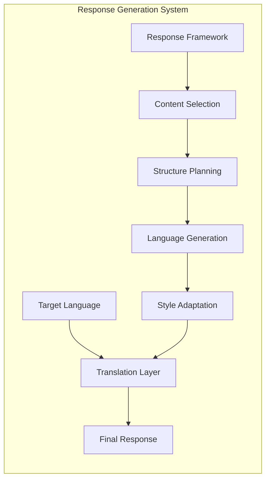

The Response Generation System produces the final output:

- **Content Selection**: Determines what information to include
- **Structure Planning**: Organizes response for clarity and coherence
- **Language Generation**: Produces grammatically correct text
- **Style Adaptation**: Adjusts tone and formality to match context
- **Translation Layer**: Converts response to the target language if needed

## 4. Data Requirements

### 4.1 Training Data Types

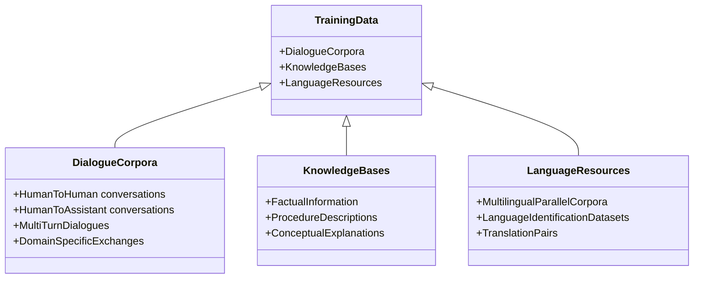

The model requires diverse training data including:

- **Dialogue Corpora**: Multi-turn conversations showing natural dialogue flow
- **Knowledge Bases**: Factual information to support accurate responses
- **Language Resources**: Multilingual data for language detection and translation
- **Specialized Datasets**: Domain-specific conversations for particular use cases

### 4.2 Data Processing Pipeline

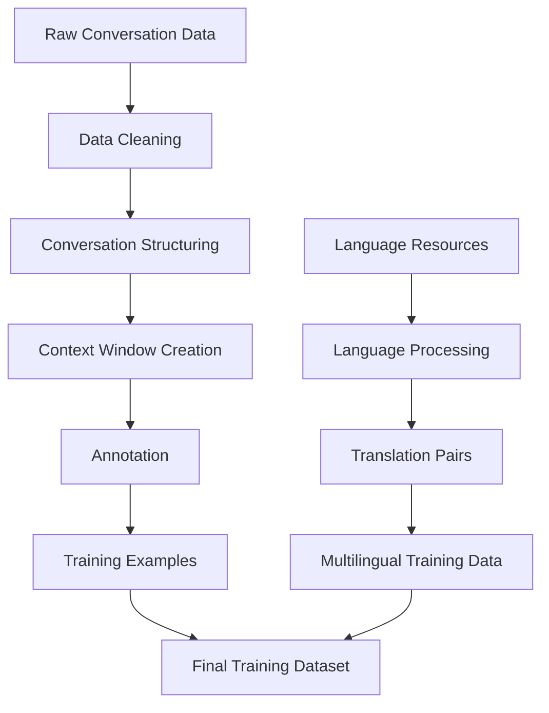

The data processing pipeline transforms raw conversation data into structured training examples:

- **Data Cleaning**: Remove noise, fix formatting issues, handle personally identifiable information
- **Conversation Structuring**: Organize into clear turn-taking format
- **Context Window Creation**: Generate examples with varying amounts of conversation history
- **Annotation**: Add metadata like topics, intents, and language tags
- **Language Processing**: Prepare multilingual capabilities through parallel data

## 5. Training Methodology

### 5.1 Training Phases

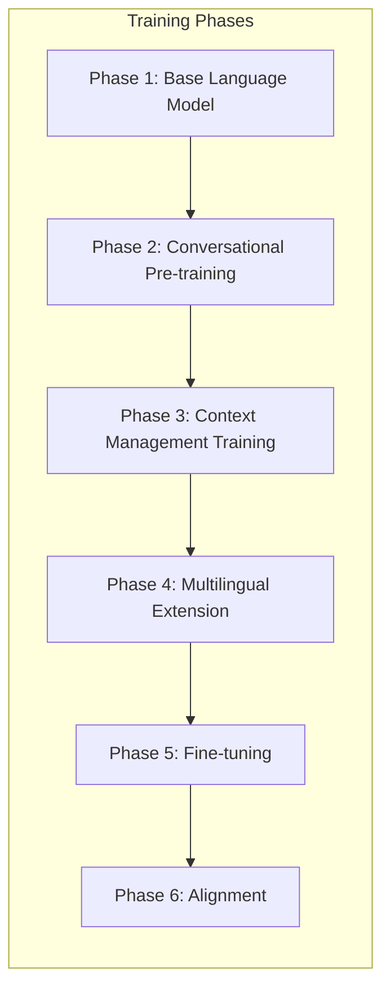

The model is trained through sequential phases:

- **Phase 1**: Train a base language model for general text generation
- **Phase 2**: Specialize for conversation with dialogue-specific pre-training
- **Phase 3**: Train context management capabilities using multi-turn examples
- **Phase 4**: Add multilingual capabilities through specialized training
- **Phase 5**: Fine-tune on high-quality conversation examples
- **Phase 6**: Align with human preferences for safety and helpfulness

### 5.2 Technical Training Process

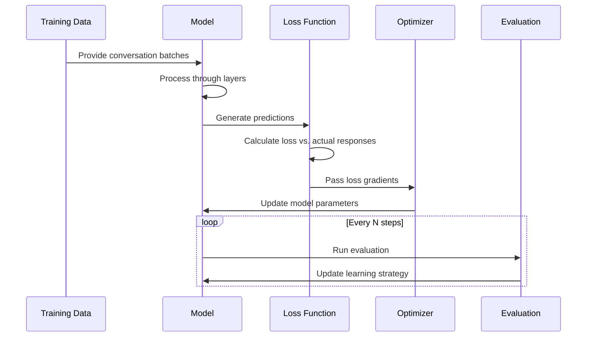

The training process involves:

- **Batch Processing**: Input conversations are processed in batches
- **Forward Pass**: Model generates predictions based on current parameters
- **Loss Calculation**: Difference between predicted and actual responses is quantified
- **Parameter Updates**: Model parameters are adjusted to reduce loss
- **Periodic Evaluation**: Model is regularly evaluated on held-out conversations
- **Learning Rate Scheduling**: Training pace is adjusted based on progress

## 6. Technical Implementation Specifications

### 6.1 Model Architecture

```mermaid
classDiagram
    class ConversationalModel {
        +InputProcessor
        +ContextManager
        +LanguageDetector
        +ReasoningEngine
        +ResponseGenerator
        +process(userInput)
        +generateResponse()
    }
    
    ConversationalModel *-- InputProcessor
    ConversationalModel *-- ContextManager
    ConversationalModel *-- LanguageDetector
    ConversationalModel *-- ReasoningEngine
    ConversationalModel *-- ResponseGenerator
    
    class InputProcessor {
        +normalize(text)
        +tokenize(text)
        +extractFeatures(tokens)
    }
    
    class ContextManager {
        -shortTermMemory[]
        -longTermMemory{}
        +addToHistory(exchange)
        +retrieveContext(query)
        +updateMemory(response)
    }
    
    class LanguageDetector {
        +detectLanguage(text)
        +getConfidenceScore()
        +supportedLanguages[]
    }
    
    class ReasoningEngine {
        +processInput(text, context)
        +generateInferences()
        +planResponse()
    }
    
    class ResponseGenerator {
        +generateText(framework)
        +translateIfNeeded(text, targetLang)
        +finalizeResponse()
    }
```

The technical implementation includes these key classes:

- **ConversationalModel**: The main class coordinating all components
- **InputProcessor**: Handles normalization and feature extraction
- **ContextManager**: Maintains conversation history and retrieves relevant context
- **LanguageDetector**: Identifies input language and manages multilingual capabilities
- **ReasoningEngine**: Processes input and context to plan appropriate responses
- **ResponseGenerator**: Produces the final text output

### 6.2 System Requirements

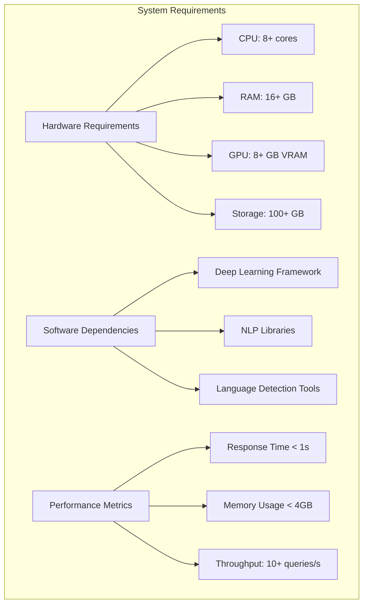

To implement the conversational model, the following is required:

- **Hardware**: Sufficient computational resources for training and inference
- **Software**: Deep learning frameworks, NLP libraries, and specialized tools
- **Performance**: Metrics to ensure acceptable user experience

## 7. Evaluation Framework

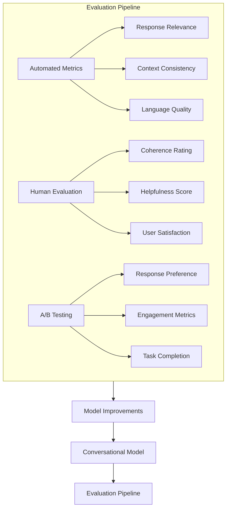

The evaluation framework uses multiple approaches:

- **Automated Metrics**: Quantitative measures of response quality
- **Human Evaluation**: Qualitative assessment by human raters
- **A/B Testing**: Comparison of different model versions
- **Continuous Improvement**: Feedback loop for model refinement

## 8. Implementation Roadmap

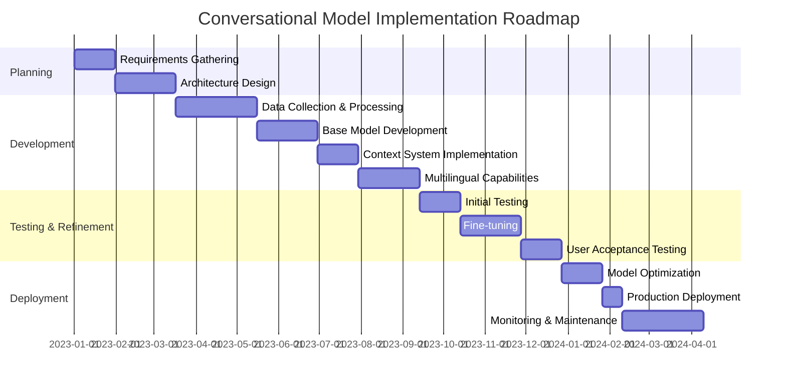

The implementation follows a phased approach:

1. **Planning Phase**: Requirements gathering and architecture design
2. **Development Phase**: Data preparation and model construction
3. **Testing & Refinement Phase**: Evaluation and fine-tuning
4. **Deployment Phase**: Optimization and production rollout

## 9. Multilingual Processing Workflow

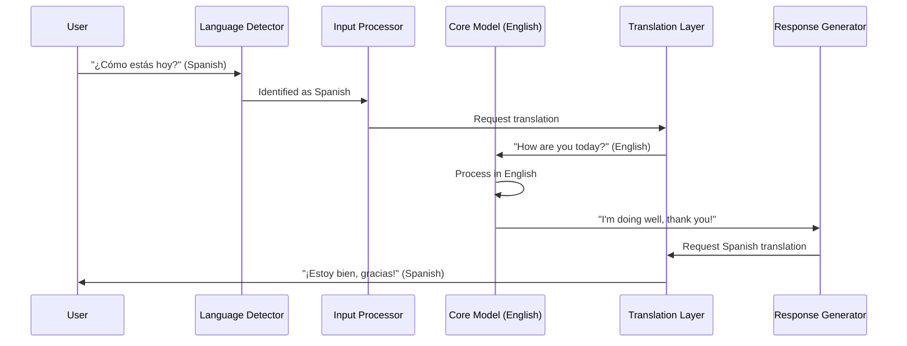

The multilingual workflow demonstrates:

1. **Language Detection**: User input language is identified
2. **Translation to Core Language**: Input is translated to the model's core language
3. **Core Processing**: Logic happens in the core language
4. **Response Translation**: Output is translated back to the user's language

## 10. Conversation Flow with Memory

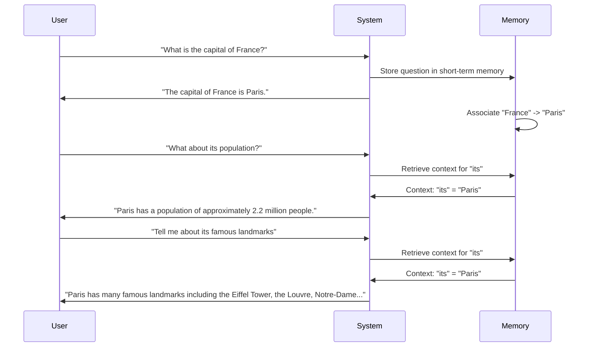

This sequence demonstrates how the memory system:

1. **Stores Information**: Captures key facts from the conversation
2. **Resolves References**: Determines what pronouns and references point to
3. **Maintains Context**: Enables coherent multi-turn conversations

## 11. Risks and Mitigations

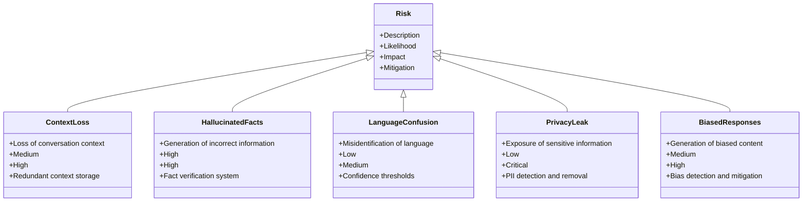

The implementation addresses various risks:

- **Context Loss**: Redundancy in memory systems
- **Hallucinated Facts**: Verification processes
- **Language Confusion**: Confidence thresholds and fallbacks
- **Privacy Leaks**: Detection and removal of sensitive information
- **Biased Responses**: Monitoring and mitigation strategies

## 12. Conclusion

This technical document outlines the comprehensive architecture and implementation approach for building a conversational model from scratch. The model design balances complexity, performance, and capability to create a system that can engage in natural, multi-turn dialogue across languages while maintaining contextual awareness.

By following this technical specification, development teams can construct a conversational AI system that handles the fundamental challenges of dialogue: context management, language understanding, reasoning, and natural response generation.


Example : 


Here's a visualization of the conversational model from scratch using Mermaid diagrams:

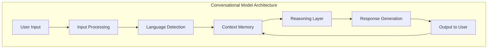

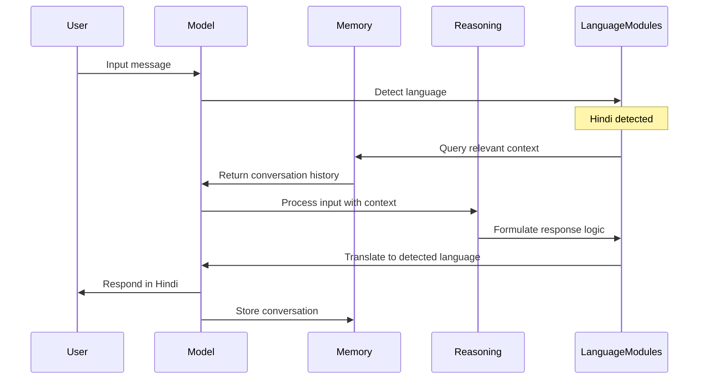

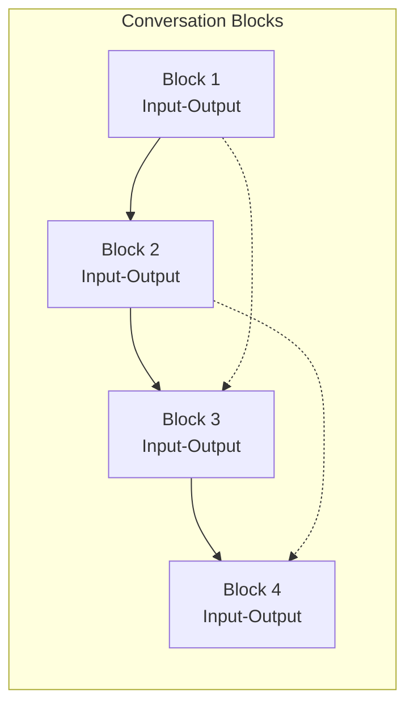

```mermaid
graph TB
    subgraph "Language Processing Example"
        Input["Hindi Input:<br/>आप कौन हैं"] --> Process["Internal Processing:<br/>Maps to English: 'Who are you?'"]
        Process --> Reasoning["Reasoning Layer:<br/>Formulates appropriate response"]
        Reasoning --> Translation["Translation Layer:<br/>Converts to Hindi"]
        Translation --> Output["Hindi Output:<br/>मैं एक छोटी भाषा मॉडल हूँ"]
    end
```

```mermaid
graph LR
    subgraph "Model Learning Process"
        A[Training Data] --> B[Base Model]
        B --> C[Human Conversations]
        C --> D[Feedback Loop]
        D --> E[Improved Model]
        E --> F[More Human-like Responses]
    end
```

These diagrams illustrate:
1. The overall architecture of the conversational model
2. The sequence of handling a multilingual conversation
3. How conversation blocks connect with references to previous blocks
4. The language processing flow for a Hindi example
5. How the model learns to become more human-like through training
